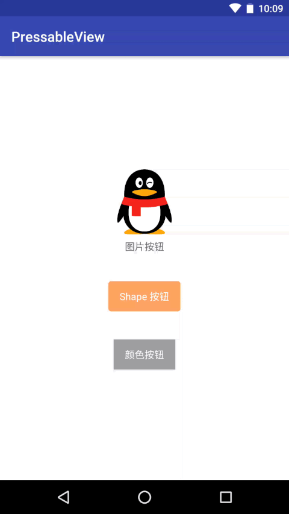

PressableView
---

一种简单的按下变暗效果的通用实现，可以通过设置背景为图片/颜色/Shape 来自动生成按下变暗效果，避免编写大量的 selector。

效果：



实现方式：

给 FrameLayout 设置前景。之所以选择 FrameLayout 是因为它可以在低版本上设置前景并且作为布局可以放入其他控件。

```java
StateListDrawable stateListDrawable = new StateListDrawable();

Drawable.ConstantState constantState = backgroundDrawable.getConstantState();

if (constantState == null) {
    return;
}

Drawable pressedDrawable = constantState.newDrawable().mutate();
backgroundDrawable.mutate();

pressedDrawable.setColorFilter(pressedFilter, PorterDuff.Mode.MULTIPLY);

stateListDrawable.addState(new int[]{android.R.attr.state_pressed}, pressedDrawable);
stateListDrawable.addState(new int[]{0}, new ColorDrawable(Color.parseColor("#00000000")));

setForeground(stateListDrawable);
```